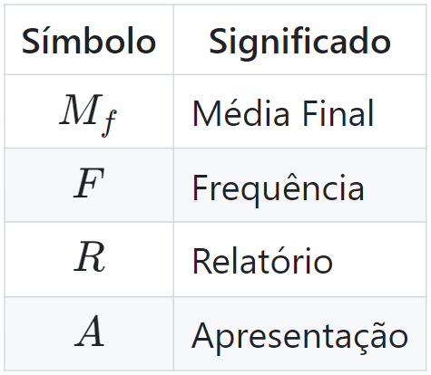

# CC0463 - Estatística Aplicada

Michael Souza

---
## Avaliação

A avaliação será baseada na participação em aula (frequência) e na qualidade dos trabalhos apresentados. Utilizando a seguinte fórmula:

$$M_f = 0.2 \times F + 0.4 \times R + 0.4 \times A,$$

onde 

$$F=\frac{F_{max} - F_{real}}{F_{max}},$$

onde $F_{max}$ é o número máximo de faltas permitidas para não ser reprovado por falta e $F_{real}$ é o número de faltas do aluno.

---
## Projeto

O projeto consistirá na análise de um conjunto de dados reais, com o objetivo de responder a uma pergunta de pesquisa. O projeto será desenvolvido em grupo e apresentado ao final do curso.

---

### Etapas do Projeto

1. As equipes...
    - serão 5 alunos (11 equipes)
    - devem ter um veterano e um calouro
    - são fixas e não podem ser alteradas

---
### Etapas do Projeto

2. Escolha de um conjunto de dados
    - O conjunto de dados deve ser real e conter informações suficientes para responder a uma pergunta de pesquisa
    - O conjunto de dados deve ser disponibilizado publicamente
    - Os critérios para escolha do conjunto de dados serão discutidos em sala de aula

---
### Etapas do Projeto
3. Formulação de uma pergunta de pesquisa
    - Deve ser clara e objetiva
    - Deve ser relevante e factível
    - Deve ser respondida com base nos dados disponíveis

---
### Etapas do Projeto
4. Análise exploratória dos dados
    - Análise descritiva dos dados
    - Análise gráfica dos dados
    - Análise de associação entre variáveis

5. Análise estatística dos dados
    - Escolha de um teste estatístico apropriado
    - Aplicação do teste estatístico
    - Interpretação dos resultados

---
### Etapas do Projeto
5. Apresentação dos resultados
- Relatório escrito
    - O relatório escrito deve conter uma introdução, uma descrição dos dados, a metodologia utilizada, os resultados obtidos e uma discussão dos resultados;
    - Deve ter no mínimo 5 páginas e no máximo 10 páginas;
    - Deve ser escrito em formato de artigo científico;

---
### Etapas do Projeto
5. Apresentação dos resultados
- Apresentação oral
    - A apresentação oral deve conter uma introdução, uma descrição dos dados, a metodologia utilizada, os resultados obtidos e uma discussão dos resultados;
    - Duração entre 10 e 15 minutos;
    - Máximo de 10 slides;

---

### Possíveis conjuntos de dados

- [Kaggle](https://www.kaggle.com/datasets)
- [UCI Machine Learning Repository](https://archive.ics.uci.edu/ml/index.php)
- [Data.gov (US)](https://www.data.gov/)
- [Wiki: Datasets for machine-learning research](https://en.wikipedia.org/wiki/List_of_datasets_for_machine-learning_research)
- [Reddit: Data Science](https://www.reddit.com/r/datascience/)
- [Google: Dataset Search](https://datasetsearch.research.google.com/)

---

### Possíveis conjuntos de dados
- [Brasil.io](https://brasil.io/datasets)
- [Dados.gov.br](https://dados.gov.br/home)
- [Banco Central do Brasil](https://opendata.bcb.gov.br/)
- [Portal da Transparência](https://portaldatransparencia.gov.br/)
- [Secretária de Segurança Pública CE](https://www.sspds.ce.gov.br/estatisticas-2/)

---

### Sobre a escolha do conjunto de dados

- Cada integrante deve escolher um conjunto de dados
- O grupo deve escolher um dos conjuntos de dados até o dia 05/04
- Cada grupo deve escolher um conjunto diferente
- Cada integrante deve preencher o formulário com o seu conjunto de dados
---

<!-- _backgroundColor: orange -->

# Perguntas?

